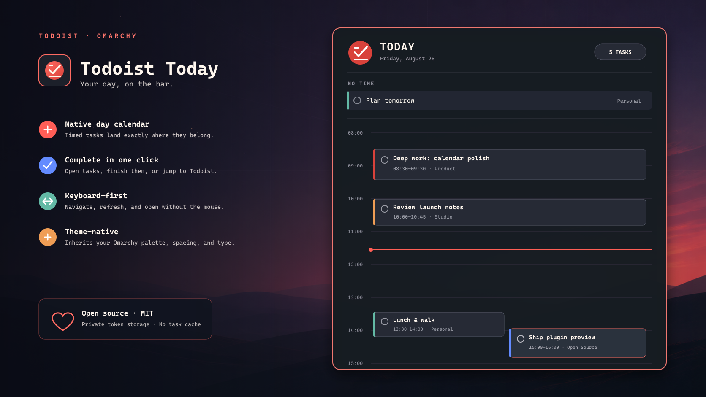

# Todoist Today for Omarchy Quattro

A theme-native Todoist day calendar for the Omarchy bar. It puts date-only
tasks in an all-day strip, lays timed tasks onto a day rail, resolves overlaps
into lanes, and follows the active Omarchy theme.



## Install

```bash
omarchy plugin add https://github.com/Erscheinung/omarchy-todoist-today.git --enable
```

## Connect Todoist

Open the new bar widget and paste a
[Todoist personal API token](https://todoist.com/app/settings/integrations/developer)
into its setup card. The token is passed to the local setup helper over stdin
and stored in `~/.config/todoist/omarchy-token` with mode `600`; it is never
written inside the plugin checkout or placed in a process argument.

For terminal-only setup, run:

```bash
~/.config/omarchy/plugins/io.github.erscheinung.todoist-today/scripts/configure-token
```

Calendar dependencies are `curl` and `jq`, both included with Omarchy. Quick
Add uses Todoist's official CLI:

```bash
npm install -g @doist/todoist-cli
td auth login
```

## Use

- Left-click the bar count to toggle the calendar.
- Middle-click refreshes; right-click opens Todoist Today.
- Click a task to open it, or its circle to complete it.
- Click `+` in the panel to add a task with Todoist Quick Add syntax through
  the official `td` CLI. Task text is sent to the helper over stdin. Typing
  `p` suggests priorities, while `#` searches projects fetched through `td`.
  Todoist natural-language dates, recurring schedules, deadlines, reminders,
  and durations are highlighted as you type, with completions for forms such
  as `tom 14:30 for 15m` and `every day from 10 May until 20 May`. Use Up/Down
  and Tab or Enter to accept a suggestion.
- Use `j`/`k` and Enter in the panel, or `r` (refresh), `n` (now), `o` (open), and Escape.

The panel refreshes every five minutes and when opened after two minutes of
inactivity. Completing a recurring task advances it exactly as Todoist does.

## Remove

```bash
omarchy plugin remove io.github.erscheinung.todoist-today --yes
```

The credential is intentionally kept when the plugin is removed. To remove it
too, delete `~/.config/todoist/omarchy-token`.

## Privacy and permissions

The calendar helper makes HTTPS requests only to `api.todoist.com`. Quick Add
runs the official `td` CLI, which manages its own OAuth credential. The plugin
reads today's active tasks and project names, and sends a close request only
when you click a task's completion circle. Task contents stay in memory and
are not cached.

## Acknowledgements

The current/next task label is inspired by
[Gardy Armand's omarchy-todoist](https://github.com/xak47d/omarchy-todoist).
The secure `td` Quick Add bridge is adapted from
[David Ojeda Lopez's omarchy-todoist](https://github.com/davidojedalopez/omarchy-todoist).
Both are MIT-licensed; see [THIRD_PARTY_NOTICES.md](THIRD_PARTY_NOTICES.md).

## Development

```bash
omarchy plugin validate .
qmllint -I /usr/share/omarchy/shell BarWidget.qml Panel.qml
bash -n scripts/todoist scripts/configure-token
python -m py_compile scripts/quick-add
```
